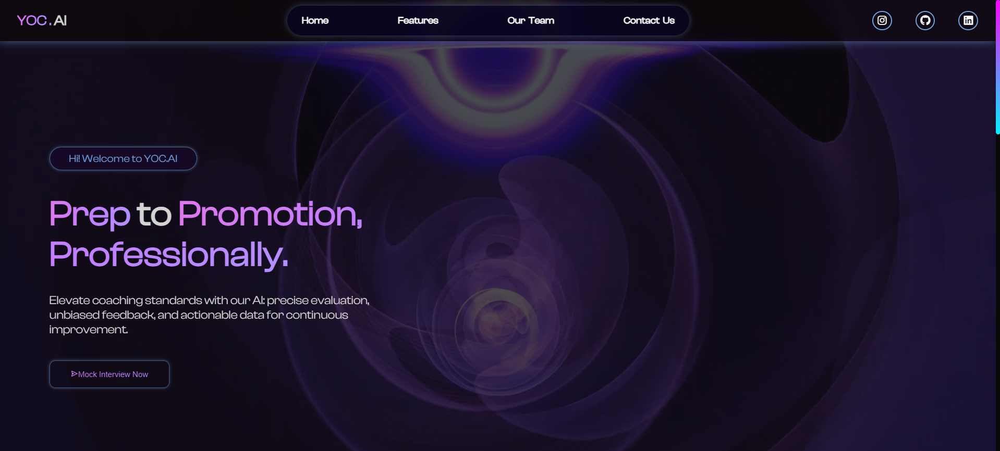

# 🚀 YOC.ai Website

Welcome to our YOC.ai website.

---

## 🌐 Live Site

🔗 [View Live Portfolio](https://KeshavDeploys.github.io/Portfolio)

---

## 📸 Screenshots

### Desktop View

## 🛠️ Built With

- **HTML5** – semantic structure
- **CSS3** – custom styling & responsive design
- **JavaScript (Vanilla)** – interactivity
- **Web3Forms** – for contact form integration
- **GitHub Pages** – for deployment

---

🎯 Features 
🎥 Background video effects (galaxy + blackhole) 
📱 Fully responsive (optimized for 480px and up) 
🧩 Modular sections: Hero, About, Skills, Projects, Contact 
📬 Contact form (Web3Forms) 
🧠 Cloud branding, animation, and interactive design 
🔗 GitHub repo buttons for each project 

📬 Contact Me 
Feel free to connect or collaborate: 
LinkedIn 
GitHub 
Instagram 

📝 License 
This project is open source and free to use — feel free to fork, reference, or build on top of it! 
 
Let me know if you’d like to add badges (like GitHub stars, last commit, etc.) or dark mode screenshots! 
